<h1 align="left">
    
    NotABug Mobile
</h1>

This application was intended to be a nice Material Design 3 compliant frontend for the notabug.org website. It was my first attempt to write an application using Kotlin.

## Project's Fate

As it turns out, [notabug.org](https://notabug.org) uses Gogs as their hosting system, and every Gogs website should have a proper API, right? Even tho I am not aware of how to use such API against [notabug.org](htttps://notabug.org), it's clearly certain that using the API directly is much more appropriate and reliable than parsing the contents of web pages (this is how the app currently works). Therefore, I decided to take a break in development of this app, seeing how its code gets more and more cluttered with tangled inheritance involving generics.

Recently I had discovered an application called [GitTouch](https://f-droid.org/repo/io.github.pd4d10.gittouch), the concept of which I really liked. So, maybe some time in the future I will create a similar frontend for several code-hosting platforms at once, using the knowledge I gained and designs I created during the development of NotABug Mobile.

## Implemented Features

<h4 align="center"> Browse anonymously or while logged in, the app will save your credentials if needed</h4>

    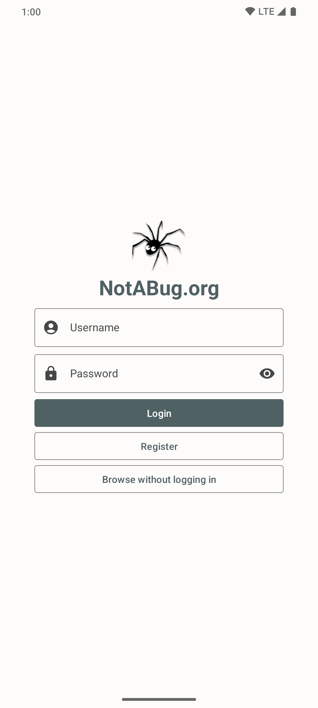
    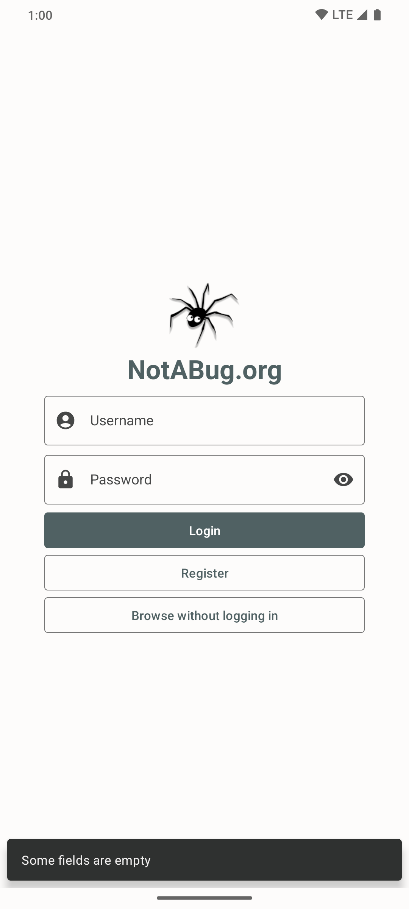
    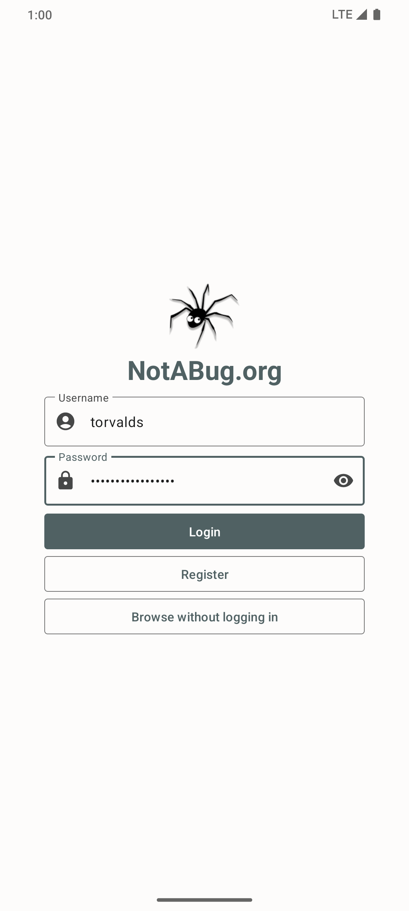
    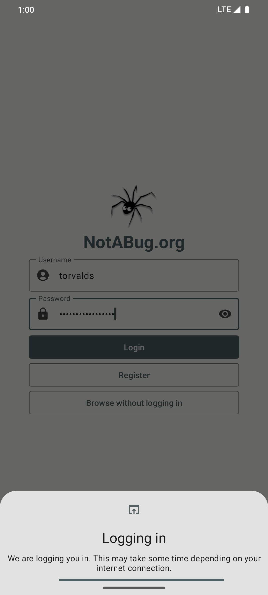

    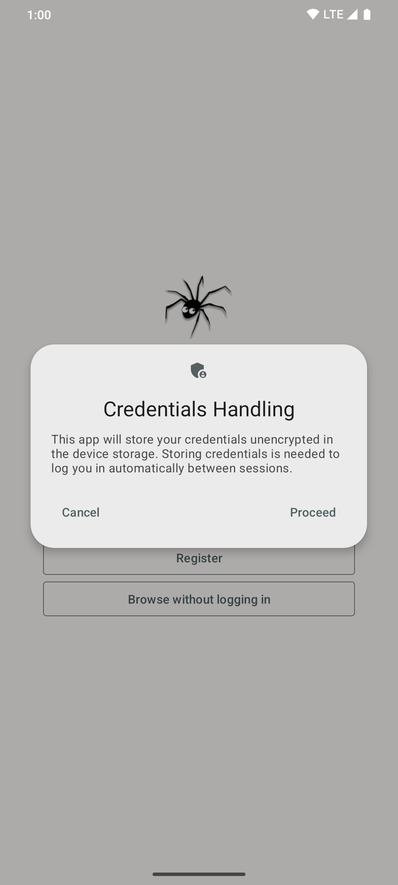
    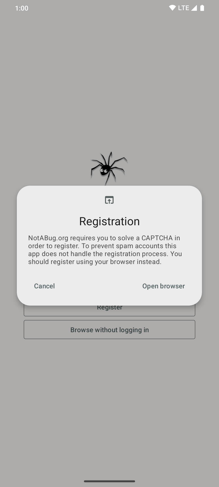
    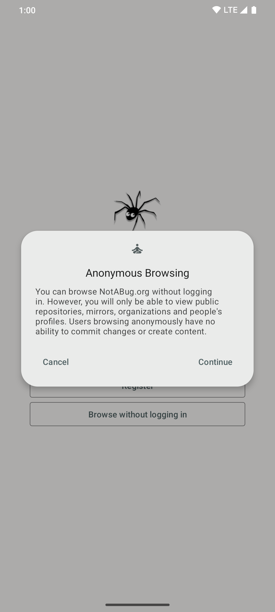
    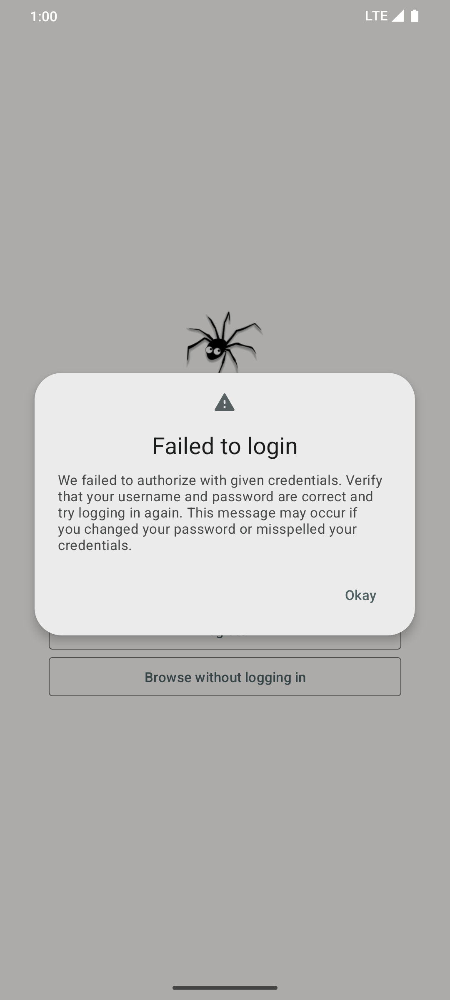

<h4 align="center">Personalized browsing</h4>

    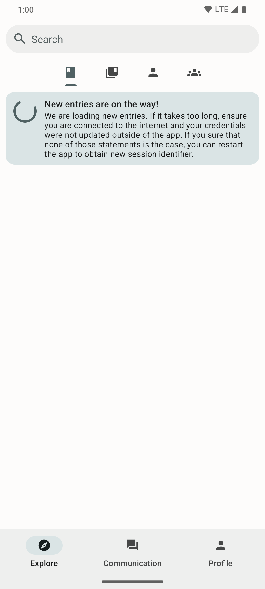
    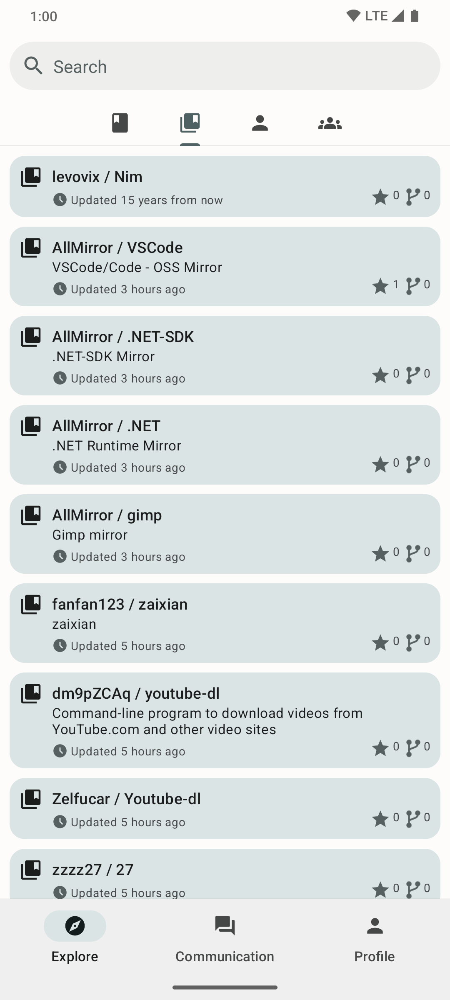
    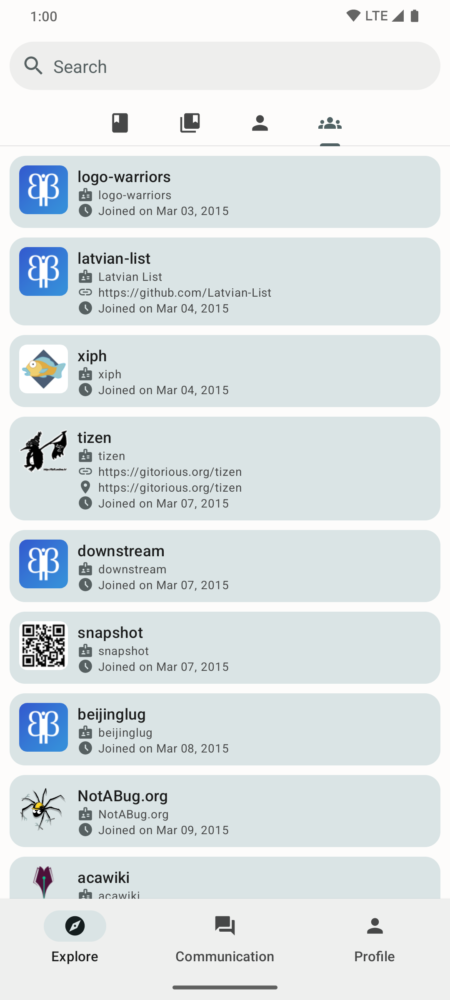

<h4 align="center">Anonymous browsing</h4>

    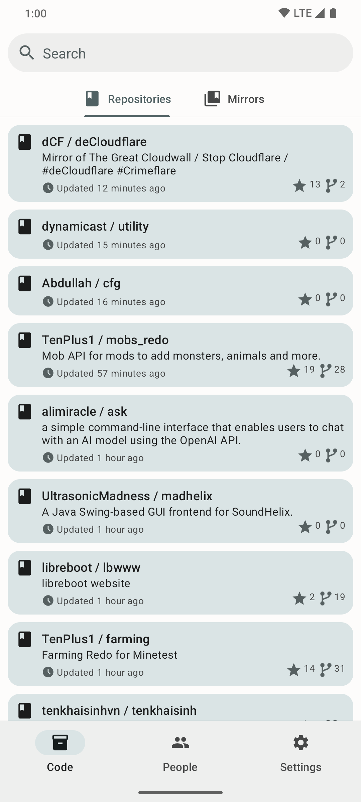
    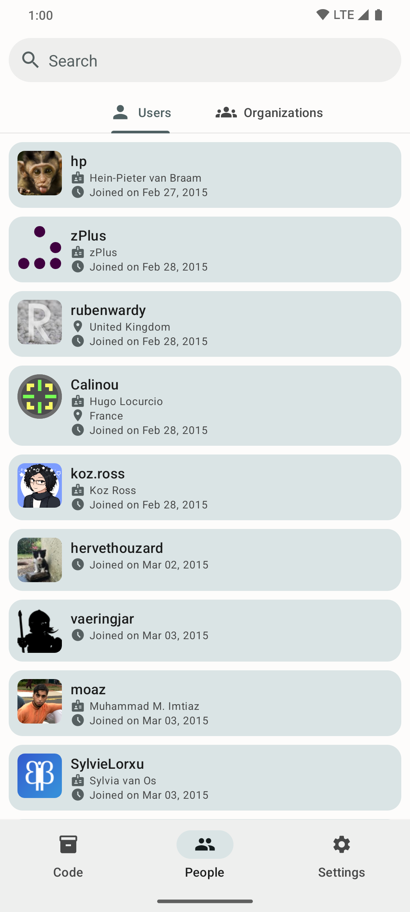
    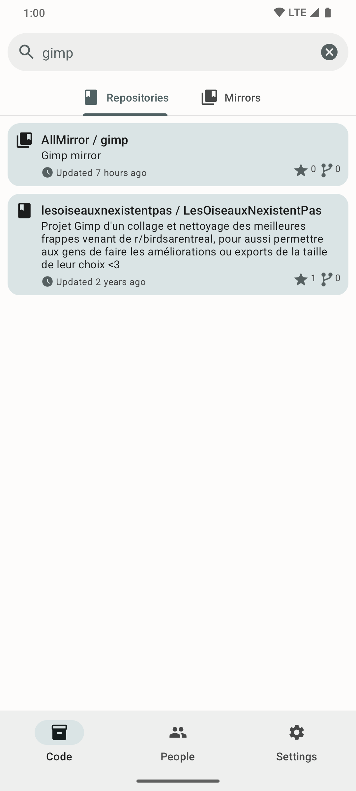

<h4 align="center">Review individual repositories and mirrors</h4>

    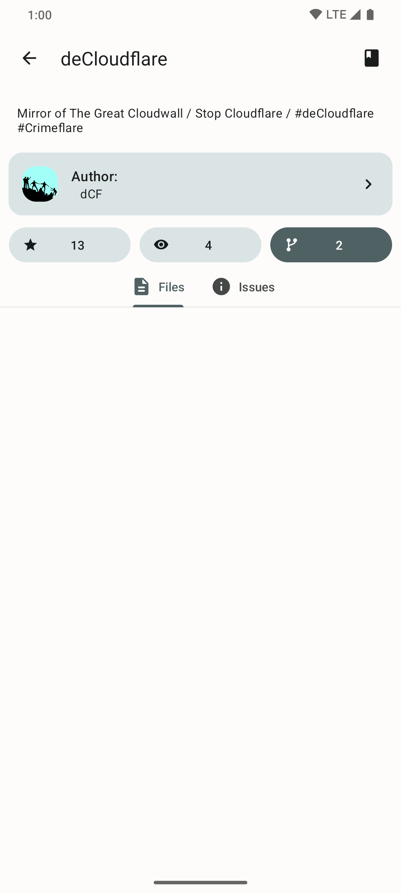
    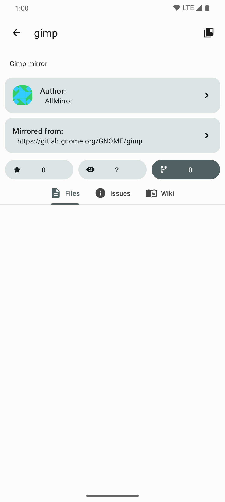
    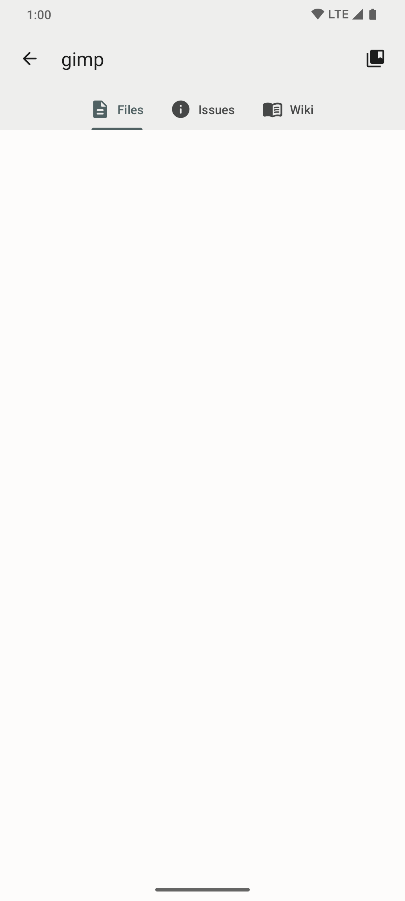

## Licensing

NotABug Mobile is licensed under [GNU Affero General Public License version 3](license) and provided "as is" with no warranties and no responsibility for possible damage. 

If you are interested in reviving this project, feel free to open a pull request or an issue, describing your thoughts.